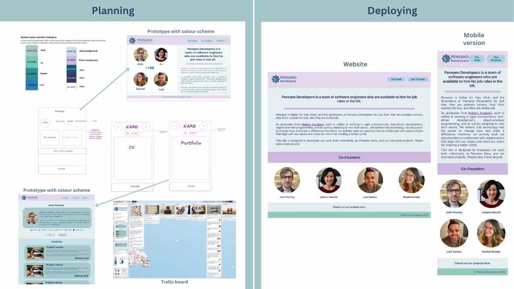

# Pensano Developers  
Pensano is Italian for they think; and the developers at Pensano Developers do just that: they are problem solvers, they think outside the box, and they are deliberate.

As a team of four graduates from Makers Academy, each is skilled at working in agile environments, test-driven development, object-oriented programming, and at quickly adapting to new tech stacks. We believe that technology has the power to change lives and make a difference, therefore, we actively seek out opportunities to collaborate with organizations that align with our values and share our vision for creating a better world. 

This site was designed to showcase our work both collectively, as Pensano Devs, and our individual projects.

# Ideation and Planning
Aiming for a mobile-responsive website, we used Excalidraw, Canva and Trello for diagramming, prototyping and tracking our progress. 

# Getting Started with Create React App

This project was bootstrapped with [Create React App](https://github.com/facebook/create-react-app).

In the project directory, you can run:

### `npm start`

Runs the app in the development mode.\
Open [http://localhost:3000](http://localhost:3000) to view it in your browser.

The page will reload when you make changes.\
You may also see any lint errors in the console.

### `npm test`

Launches the test runner in the interactive watch mode.\
See the section about [running tests](https://facebook.github.io/create-react-app/docs/running-tests) for more information.

## Deploying

We purchased the domain and used GitHub Action workflows to build and deploy the website.

## Learn More

You can learn more in the [Create React App documentation](https://facebook.github.io/create-react-app/docs/getting-started).

To learn React, check out the [React documentation](https://reactjs.org/).
